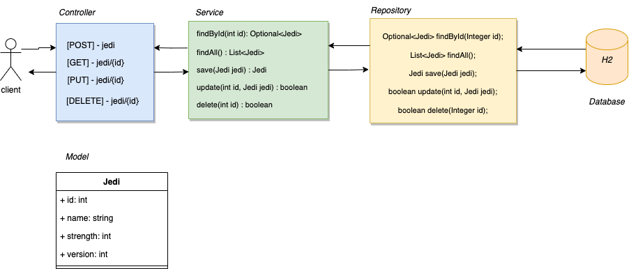

<p align="center">

</p>
<h1 align="center">API Star-Wars</h1>
<p align="center">
</p>

<p> <i>Sobre a api: </i>
essa api é responsável por gerenciar a criação de novos Jedis. E foi desenvolvida durante as aulas do Bootcamp de Java da Womakerscode, dentre os temas estudados em sala de aula tivemos: utilização do maven para gerenciar as dependências, utilização da arquitetura MVC na estruturação do microsserviço, desenvolvimento de testes Unitários.
 </p>
 
 <h4>Alguns pontos importantes vistos durante o desenvolvimento dessa aplicação:</h4>
 <ul>
 
<li><i>O que é uma api REST: </i> Uma API de REST é uma API que se modela aos princípios de projeto do REST ou o estilo de arquitetura do Representational State Transfer. Por esta razão, as APIs de REST são muitas vezes chamadas de APIs de RESTful. 
 
No nível mais básico, uma API é um mecanismo que permite que um aplicativo ou serviço acesse um recurso dentro de outro aplicativo ou serviço. O aplicativo ou serviço que está realizando o acesso é chamado de cliente, e o aplicativo ou serviço contendo o recurso é chamado de servidor.
 (Fonte: https://www.ibm.com/br-pt/cloud/learn/rest-apis)
 </li>
<li><i>O que é TDD: </i> o significado da sigla é <i>Test Driven Development</i>, que de maneira simplificada, significa desenvolvimento orientado a testes. Nesse fluxo, começamos o desenvolvimento a partir dos cenários de teste e não na própria implementação. A ideia é criar um cenário que traga como resultado falha, e ir corrigindo conforme a necessidade de fazer com que o teste seja executado com sucesso.

</li>
 </br>
<li><i>O que é o maven: </i> o maven nada mais é do que um gerenciador de dependências, que podemos utilizar nos nossos projetos com java e springboot. Através dele, temos como adicionar, remover, dentre outras funcionalidades dependências que serão utilizadas no projeto de uma maneira simpliicada, basta ajustar os valores contidos no arquivo pom.xml.

</li>
   </br>
<li><i>O que são testes unitários: </i> são testes que tem como objetivo focar nas funcionalidades específicas do projeto, e não em um fluxo completo como um todo. Por exemplo, podemos ter testes unitários para o cenário de Repositories, Services e Controllers, e cada teste que iremos implmementar tem a responsabilidade de validar o comportamento de cada uma dessas camadas de forma isolada, utilizando o recurso de mocks.
</li>

</ul>
 <h4>Bibliotecas utilizadas no desenvolvimento:</h4>
 
```bash

  spring-boot-starter-data-jdbc
  spring-boot-starter-web
  h2database
  spring-boot-starter-test
  junit-jupiter-api
  dbunit
  ider-core
  spring-test-dbunit
```

 <h4>Diagrama das entidades da aplicação:</h4>
 

 
  </br>
 <h4>Requests e Responses dos endpoints da aplicação:</h4>
 
 <h5>Criação de um novo Jedi:</h5>
 
 ```bash
 Request:

 curl --location --request POST 'localhost:8080/jedi' \
--header 'Content-Type: application/json' \
--data-raw '{
    "name": "teste",
    "strength": 123
}'

Response: 200 - OK

{
    "id": 1,
    "name": "teste",
    "strength": 123,
    "version": 1
}

```

<h5>Busca de Jedi por Id:</h5>
 
 ```bash
 Request:

curl --location --request GET 'localhost:8080/jedi/1' \
--header 'Content-Type: application/json' \
--data-raw '{
    "name": "teste",
    "strength": 123
}'

Response: 201 - Created

{
    "id": 1,
    "name": "teste",
    "strength": 123,
    "version": 1
}

```

<h5>Alteração nos dados do Jedi:</h5>
 
 ```bash
 Request:

curl --location --request PUT 'localhost:8080/jedi/1' \
--header 'Content-Type: application/json' \
--data-raw '{
    "name": "teste 2",
    "strength": 123
}'

Response: 204 - No Content

```

<h5>Remoção nos dados do Jedi:</h5>
 
 ```bash
 Request:

curl --location --request DELETE 'localhost:8080/jedi/1'

Response: 204 - No Content

```
